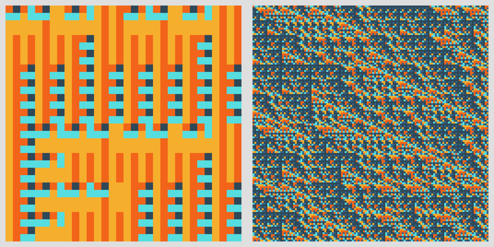

# Substitution System

[Substitution System](https://piebro.github.io/substitution-system) is a simple website to generate generative art using a substitution system. This works by using a random color palette and generating random replacement rules for each color. The replacement rules are a 2x2 grid of random colors from the color palette. A starting 2x2 grid is created, and the replacement rules are applied multiple times to transform the starting grid, doubling the size of the grid in each iteration. Here are two examples:



## Plotting Pixel Art


These images also look good when drawn with a pen plotter using [vpype](https://github.com/abey79/vpype) and the [vpype pixelart](https://github.com/abey79/vpype-pixelart) plugin.

To plot the images yourself, install [vpype](https://github.com/abey79/vpype) with the [vpype pixelart](https://github.com/abey79/vpype-pixelart) plugin.

The following example command can be used to create a plot using a small substitution image (not the one with 1024x1024 pixels).

```bash
vpype pixelart \
    --mode line \
    --pen-width 0.6mm \
    --overdraw 0.1 \
    --upscale 5 \
    <path-to-pixelart-image.png> \
    linesort --no-flip \
    write \
    --page-size 10.0x10.0cm \
    --center \
    pixelart.svg

# save the layers of the pixelart.svg in separate files
vpype read pixelart.svg forlayer write "plot%_name or _lid%.svg" end
```

Use `vpype pixelart --help` to get more information about the arguments.

Next, I use the [AxiCLI](https://axidraw.com/doc/cli_api/#introduction) to plot the image with the following commands.

```bash
# get a preview with the timings
axicli plot.svg --model 2 -vg3 --speed_pendown 15 --report_time -o preview.svg

# plot the image
axicli plot.svg --model 2 --speed_pendown 15 --pen_pos_down 40
```

Here are two examples I plotted.


Sometimes, it might also look good if the layers are not perfectly aligned.


## Contributing

Contributions to this project are welcome. Feel free to report bugs, suggest ideas, or create merge requests.

## Developing

The project uses [Prettier](https://prettier.io/playground/) for linting JavaScript with a `print-width` of 120, `tab-width` of 4, and using single quotes.

## Website Statistics

There is lightweight tracking for the website using Plausible. Anyone interested can view these [statistics](https://plausible.io/piebro.github.io%2Fsubstitution-system). It's worth noting that these statistics might be an underestimate as many users, including myself, use AdBlockers.

## License

This project is licensed under the MIT License - see the [LICENSE](LICENSE) file for details.